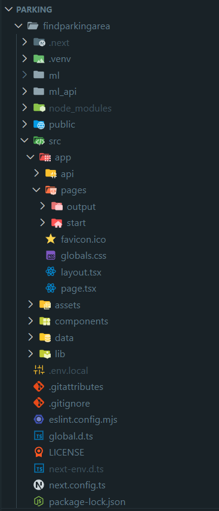

# AI 기반 주차장 추천 서비스

  키워드를 검색하면 검색어가 들어간 **서울 시내의 주차장**을 불러오고,  
  **AI 점수 + 사용자 피드백** 을 반영해 더 나은 주차장을 추천해 주는 웹 서비스입니다.

> 예: `서울과기대`, `노원역` 같은 키워드를 입력하면 인근 공영·민영 주차장 정보를 불러오고  
    각 주차장의 **추천도(점수)** 를 함께 보여줍니다.

---
## 프로젝트 구조
  이 프로젝트는 **프론트엔드와 백엔드가 분리된 구조**입니다.

- **Frontend**
  - Next.js(React, TypeScript) 기반
  - 환경 변수(`NEXT_PUBLIC_API_BASE_URL`)를 통해 백엔드 URL을 주입받음

- **Backend (ML API)**
  - FastAPI 기반 Python 서버
  - Uvicorn으로 구동
  - 주차장 데이터(CSV/JSON)와 머신러닝 로직을 이용해 점수 계산
  - `POST /recommend_list` 등의 엔드포인트를 통해 프론트와 통신
---
## 주요 기능

- **키워드 기반 주차장 검색**
  - 장소명, 지역명 등을 입력하면 해당 키워드가 포함되어 있는 주차장 목록을 조회합니다.   
- **Ai 추천 점수(추천도) 표시**
  - 기본 점수 + 사용자 피드백이 반영된 **조정 점수**를 함께 표시합니다.
- **좋아요 / 싫어요 피드백**
  - 각 주차장 카드에서 **good / bad 버튼**을 통해 선호도를 표현할 수 있습니다.
  - 피드백은 백엔드로 전송되어 추천 점수 재계산에 사용됩니다.
  - UI 상에서는 클릭 시 잠깐 활성 아이콘으로 바뀐 뒤, 원래 상태로 돌아옵니다.
- **반응형 UI (PC 우선)**
  - 데스크탑 환경을 우선으로 설계하였으며,  
    추후 모바일 대응을 고려한 레이아웃 구조를 가지고 있습니다.
---
## 추천 점수 가중치 로직

  각 주차장의 표시 점수는 크게 두 부분으로 구성됩니다.  
  **최종 추천 점수 = 기본 점수(Base Score) + 피드백 가중치(Feedback Weight)**

> **기본 점수(Base Score)**  
  └  **0**으로 고정된 초기 점수
> 
> **피드백 가중치(Feedback Weight)**  
> └  사용자의 **good 버튼** 클릭 패턴을 반영하여 실시간으로 가중되는 점수
>
> 
>  여기서는 특히 good 버튼이 어떻게 점수에 반영되는지를 설명합니다.
### ▷한 주차장에 연속으로 good을 누를 때

예를 들어 A 주차장에 대해 good 버튼을 여러 번 누른다고 가정합니다.

- **첫 번째 good 클릭**  
  - A 주차장의 피드백 가중치: `+5` 와 같이 **큰 값으로 시작**합니다.
- **같은 주차장에 대한 2번째, 3번째 good 클릭**  
  - 클릭할 때마다 증가량이 줄어듭니다.
  - 예시: `+5 → +4 → +3 → +2 → ...` 처럼 **점점 작아지는 형태**로 반영됩니다.

즉,   

**“같은 주차장에 계속해서 좋다고 누를수록 영향력은 점점 줄어들도록”**
설계되어 있습니다.

>한 번의 강한 선호 표시 이후에는, 추가 클릭이 점수에 미치는 힘을 점점 줄여서  
**특정 주차장만 무한히 클릭해서 점수를 뻥튀기하는 것을 방지**합니다.


### ▷중간에 다른 주차장에 good을 눌렀을 때 (선호도 분산 효과)

이제 A 주차장을 여러 번 눌러 점수가 올라가던 중에,  
**B 주차장에도 good 버튼을 누르는 상황**을 생각해 봅니다.

- 처음 A에만 집중해서 good을 누를 때  
  - A: `+5 → +4 → +3 → ...` (완만하게 감소)
- 그런데 중간에 B 주차장에도 good을 한 번 누르면  
  - B: `+5` (B도 처음이라 크게 올라감)
  - 이후 A에 다시 good을 눌렀을 때의 증가량은  
    - 예시: `+3`에서 **갑자기 `+0.5`처럼 확 줄어드는** 식으로 반영됩니다.

즉,

> - A, B 등 여러 주차장에 good을 나눠 누를수록  
> - **각 주차장에 추가로 들어가는 가중치는 급격하게 줄어들도록**  

만들어서,   

한 사용자가 **여러 주차장을 골고루 좋아한다고 표시하면 점수가 분산**되고,  
**특정 주차장에만 집중해서 누를 때만 그 주차장의 추천도가 더 크게 올라가도록** 설계되어 있습니다.                 

### ▷모든 주차장에 동일하게 적용되는 규칙

위에서 설명한 로직은 **특정 주차장(A, B)** 에만 적용되는 것이 아니라,  
**모든 주차장에 대해 동일한 규칙으로 적용**됩니다.

- 각 주차장마다 **자신만의 피드백 가중치**를 갖고 있고,
- 사용자가 어떤 주차장에 good을 누를지에 따라
  - 그 주차장의 증가량은 **클릭 횟수에 따라 점점 감소**하고,
  - 동시에 **다른 주차장에 대한 클릭이 많아질수록**  
    기존에 좋아하던 주차장들의 추가 증가량도 같이 줄어듭니다.

이렇게 함으로써:

1. **한 주차장에 대한 “첫 인상”은 크게 반영**하고  
2. **같은 주차장만 반복해서 누르는 효과는 점점 줄이고**  
3. **사용자의 선호가 여러 주차장에 흩어지면, 점수 또한 자연스럽게 분산**되도록 합니다.

그 결과,  
> *“실제로 사용자가 여러 주차장을 비교하며 선택하는 패턴”*  
이 추천 점수에 보다 자연스럽게 반영되도록 하는 것이 이 가중치 로직의 목표입니다.
---
## 실행 방법

이 레포지토리에 올라온 코드를 **직접 내 컴퓨터에서 실행**해 보고 싶은 사람을 위한 설명입니다.  
백엔드(FastAPI)와 프론트엔드(Next.js)를 각각 실행해야 합니다.    

### 0. 준비물

아래 프로그램들이 설치되어 있어야 합니다.

- **Git** (코드 내려받기용)  
- **Python 3.10+**  
- **Node.js 18+** (npm 포함)   

### 1. GitHub에서 코드 가져오기

#### A) git clone 사용

터미널(또는 PowerShell)을 열고 아래 명령을 입력합니다.

```bash
1. 원하는 폴더로 이동
cd C:\Users\내이름\Desktop

2. 레포지토리 클론 (USERNAME/REPOSITORY_NAME을 실제 깃허브 주소로 변경)
git clone https://github.com/USERNAME/REPOSITORY_NAME.git

3. 프로젝트 폴더로 이동
cd findparkingarea
```

#### B) 백엔드 실행 (FastAPI + Uvicorn)

```bash
1. 가상환경 생성 및 활성화 (Windows PowerShell 기준)

cd findparkingarea  (이미 이 폴더 안이라면 생략 가능)

python -m venv .venv

.\.venv\Scripts\activate
```

```bash
2. 필요한 라이브러리 설치

pip install -r requirements.txt
```

```bash
3. Uvicorn으로 FastAPI 서버 실행

uvicorn ml_api.main:app --reload --host 127.0.0.1 --port 8000

> 성공하면 터미널에 아래와 비슷한 로그가 출력됩니다.
  Uvicorn running on http://127.0.0.1:8000
```
#### C) 프론트엔드 실행 (Next.js)

```bash
1. 환경 변수 설정

프로젝트 루트(findparkingarea)에 .env.local 파일을 만들고, 다음을 입력합니다.
NEXT_PUBLIC_API_BASE_URL=http://127.0.0.1:8000
```

```bash
2. 패키지 설치 & 개발 서버 실행

새 터미널(또는 새 PowerShell)을 열고

cd REPOSITORY_NAME/findparkingarea 

npm install
npm run dev
```

```bash
3. 브라우저에서 접속

기본 주소: http://localhost:3000
```

---
## 실행 과정



